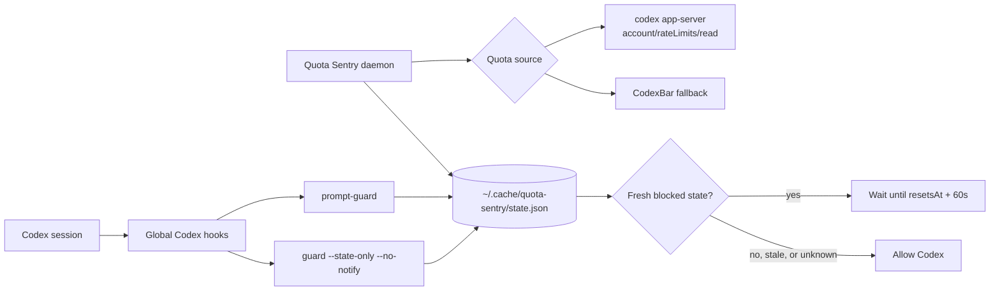

# Quota Sentry

[](LICENSE)
[](https://github.com/dhruvil009/QuotaSentry/stargazers)
[](https://www.python.org/)

Quota Sentry is a local circuit breaker for Codex quota. It watches your 5-hour usage window, records weekly usage, and pauses new Codex activity before you burn through an enforced limit.

It is for the moment when a long agent session keeps going, your quota window is nearly spent, and the next prompt or tool call should wait instead of wasting the last few percent.

```text
Quota Sentry: 94% used
Quota Sentry: waiting for Codex quota reset until 2026-06-01T21:24:05Z.
```

## Why Use It

- Avoid accidentally exhausting a paid or rate-limited Codex window.
- Keep long-running Codex sessions from starting new work when the 5-hour quota is already near the threshold.
- Fail open when quota data is unavailable, malformed, stale, or unsafe to trust.
- Keep hooks quiet so Codex does not flood the TUI with guard output after a long wait.

## Quick Start

Quota Sentry currently runs from this checkout. Packaging is intentionally not promised until the install path is real.

```bash
git clone https://github.com/dhruvil009/QuotaSentry.git
cd QuotaSentry

./scripts/quota-sentry status
./scripts/quota-sentry poll
./scripts/quota-sentry start
./scripts/quota-sentry install-hook
```

Restart Codex after installing hooks if the current session does not pick up the new global hook config.

To bypass blocking for a session:

```bash
export QUOTA_SENTRY_DISABLE=1
```

## Demo Recording

The terminal demo is scripted so the launch GIF can be reproduced without touching live Codex quota:

```bash
bash docs/demo/quota-sentry-demo.sh
vhs docs/demo/quota-sentry-demo.tape
```

## How It Works



The daemon polls quota in the background and writes a cached decision. Codex hooks read that cached state synchronously before new prompt and tool activity. Hook paths do not invoke live quota sources.

The daemon does not interrupt an already-running model request. It only affects future guarded Codex lifecycle activity.

## What It Watches

The `v0.1.x` line supports Codex only:

- Uses `codex app-server --stdio` by default, reading `account/rateLimits/read`.
- Falls back to CodexBar when `--source auto` cannot use the app-server path.
- Monitors the 5-hour window (`windowMinutes: 300`) by default.
- Records the weekly window (`windowMinutes: 10080`) as advisory status by default.
- Blocks at `usedPercent >= 95` until `resetsAt` plus a 60-second buffer.
- Weekly hard-blocking is opt-in and defaults to `99%` when enabled.
- Fails open when quota source data is missing, malformed, unavailable, or state is stale.

The background daemon polls every five minutes by default, tightens its cadence near the quota threshold, and writes state for synchronous hooks to read.

## Commands

Run from the repository root:

```bash
./scripts/quota-sentry poll
./scripts/quota-sentry start
./scripts/quota-sentry status
./scripts/quota-sentry guard
./scripts/quota-sentry stop
./scripts/quota-sentry configure --weekly-mode hard-block --weekly-threshold-percent 99
```

`status` is intentionally terse for normal use:

```text
Quota Sentry: 14% used
Quota Sentry: 5h 14% used | weekly 96% used
```

It warns when the saved quota state is stale and the background daemon is not running. Use `status --verbose` to include daemon details.

Manual `guard` self-heals by polling before deciding whether to block unless it is run with `--state-only`. Installed Codex hooks use cache-only guard paths.

`guard` keeps stdout and stderr quiet by default because Codex surfaces hook output back into the TUI after long waits. When manual `guard` starts waiting, it writes one notice directly to the controlling terminal:

```text
Quota Sentry: waiting for Codex quota reset until <timestamp>.
```

Use `./scripts/quota-sentry guard --verbose` only when running it manually and you want a captured wait message too. Use `--no-notify` to suppress the terminal notice. Use `--state-only` for hook paths that must only read cached daemon state and must not invoke a live quota source. Installed Codex hooks suppress terminal notices.

Live polling accepts `--source auto`, `--source codex-app-server`, or `--source codexbar`. The default `auto` mode tries Codex app-server first and falls back to CodexBar if needed.

## Weekly Policy

Weekly usage is advisory by default. Quota Sentry records the weekly window in `state.json` and shows it in `status`, but it will not block on weekly usage unless the user explicitly opts in.

Enable weekly hard-blocking:

```bash
./scripts/quota-sentry configure --weekly-mode hard-block --weekly-threshold-percent 99
```

Return to advisory mode:

```bash
./scripts/quota-sentry configure --weekly-mode advisory
```

When weekly hard-blocking is enabled and weekly usage reaches the configured threshold, Quota Sentry blocks until the weekly `resetsAt` plus the normal reset buffer. If both the 5-hour and weekly windows are blocked, it waits until the later relevant reset. Missing or malformed weekly data fails open for weekly enforcement.

Daemon cadence is configurable:

```bash
./scripts/quota-sentry start --interval-seconds 300
./scripts/quota-sentry start --near-threshold-percent 85 --near-interval-seconds 60
./scripts/quota-sentry start --critical-threshold-percent 93 --critical-interval-seconds 30
```

## Install Codex Hooks

Install global Codex hooks:

```bash
./scripts/quota-sentry install-hook
```

That command merges Quota Sentry hooks into `~/.codex/hooks.json` and writes a `.bak` backup if a hooks file already exists. Restart Codex after installing hooks if the current session does not pick them up.

Quota Sentry intentionally does not rely on plugin-local hooks. Current Codex builds expose global hooks, but plugin-scoped hooks are not a reliable runtime surface yet. The installer writes absolute script paths into `~/.codex/hooks.json`.

Installed hooks:

- `SessionStart`: starts the background daemon through a synchronous quiet hook. The command returns after spawning the detached daemon; Codex 0.140.0 skips async hooks.
- `UserPromptSubmit`: runs `prompt-guard`, which quietly ensures the daemon is running and then checks cached state without terminal notices.
- `PreToolUse`: runs `guard --state-only --no-notify` before tool execution, using only the daemon's latest cached state.

Installed hook commands are intentionally single commands without shell composition. The daemon is the only installed component that performs live quota-source polling.

## State

Default state lives under:

```text
~/.cache/quota-sentry/
```

Files:

- `state.json`: latest quota decision.
- `quota-sentry.pid`: daemon pid.
- `quota-sentry.log`: daemon output.

Config lives at:

```text
~/.config/quota-sentry/config.json
```

## Development

Run tests:

```bash
PYTHONPATH=src python3 -m unittest tests/test_quota_sentry.py -v
```

Run autonomous E2E tests:

```bash
./scripts/autonomous-test
```

The autonomous harness runs one live Codex quota-source smoke poll, then uses synthetic `codex` and `codexbar` binaries for quota-edge scenarios. It writes a report under `.quota-sentry-runs/`.

For clean clones without installed Codex hooks, the global hook scenario is skipped by default. Use `./scripts/autonomous-test --skip-live --require-global-hook` when you specifically need to verify that this checkout is installed in `~/.codex/hooks.json`.

## Contributing

See [CONTRIBUTING.md](./CONTRIBUTING.md) for development workflow, test expectations, hook-safety guidance, AI-generated code expectations, and guidance for adding other harnesses such as Claude Code or OpenCode.

## License

Apache License 2.0. See [LICENSE](./LICENSE).
