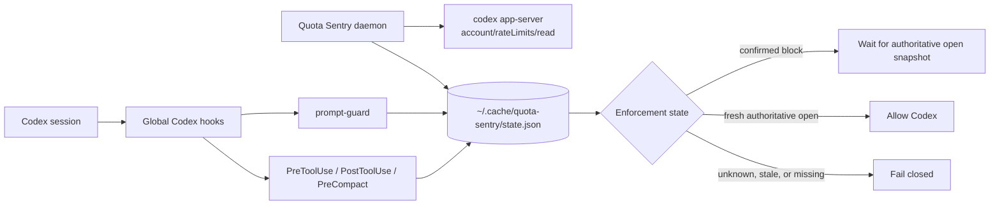

# Quota Sentry

[](LICENSE)
[](https://github.com/dhruvil009/QuotaSentry/stargazers)
[](https://www.python.org/)

Quota Sentry is a local circuit breaker for Codex quota. It discovers the quota windows Codex currently exposes, guards short-term and weekly usage, and pauses new Codex activity before you burn through an enforced limit.

It is for the moment when a long agent session keeps going, your quota window is nearly spent, and the next prompt or tool call should wait instead of wasting the last few percent.

```text
Quota Sentry: 94% used
Quota Sentry: waiting for Codex quota reset until 2026-06-01T21:24:05Z.
```

## Why Use It

- Avoid accidentally exhausting a paid or rate-limited Codex window.
- Keep long-running Codex sessions from starting new work when a short-term quota is already near the threshold.
- Refuse new lifecycle activity when quota data is unknown, stale, or unavailable.
- Keep a confirmed block latched until Codex reports that policy window below threshold.
- Keep hooks quiet so Codex does not flood the TUI with guard output after a long wait.

## Quick Start

Quota Sentry currently runs from this checkout. Packaging is intentionally not promised until the install path is real.

Requirements: Codex CLI, Python 3.9+, and macOS or Linux. Windows enforcement is not supported in `v0.1.x` because the daemon and state latch require POSIX process and file-locking semantics.

```bash
git clone https://github.com/dhruvil009/QuotaSentry.git
cd QuotaSentry

./scripts/quota-sentry status
./scripts/quota-sentry poll
./scripts/quota-sentry start
./scripts/quota-sentry install-hook
```

Restart every running Codex process after installing or updating hooks. Existing processes keep their previously loaded hook registry.

To bypass blocking for a session, launch or restart Codex with the variable set:

```bash
QUOTA_SENTRY_DISABLE=1 codex resume <session-id>
```

## How It Works


```mermaid
flowchart LR
    codex[Codex session] --> hooks[Global Codex hooks]
    hooks --> promptGuard[prompt-guard]
    hooks --> checkpoints[PreToolUse / PostToolUse / PreCompact]

    daemon[Quota Sentry daemon] --> appServer[codex app-server<br/>account/rateLimits/read]
    daemon --> state[(~/.cache/quota-sentry/state.json)]

    promptGuard --> state
    checkpoints --> state
    state --> decision{Enforcement state}
    decision -->|confirmed block| wait[Wait for authoritative open snapshot]
    decision -->|fresh authoritative open| open[Allow Codex]
    decision -->|unknown, stale, or missing| stop[Fail closed]
```

The daemon polls quota in the background and writes a cached decision. Codex hooks consume their JSON input immediately, then read cached state synchronously before prompts, tool execution, tool completion, and compaction. Hook paths do not normally invoke live quota sources.

Once a quota block is confirmed, source failures, malformed sibling windows, stale timestamps, and an expired estimated reset time cannot clear it. Codex must report the same policy window below threshold, or the user must explicitly opt out of that policy.

## What It Watches

The `v0.1.x` line supports Codex only:

- Uses `codex app-server --stdio` by default, reading `account/rateLimits/read`.
- Treats Codex app-server as the sole authority in default `auto` mode. Source failure becomes `unknown`; it never downgrades to CodexBar to clear a latch.
- Retains explicit `--source codexbar` only as an optional compatibility and test adapter.
- Reads the canonical `rateLimits` bucket and preserves the newer `rateLimitsByLimitId` multi-bucket view when Codex provides it.
- Classifies canonical windows by duration, never by whether Codex placed them in `primary` or `secondary`.
- Treats windows up to 24 hours as short-term and begins blocking at `usedPercent >= 95`.
- Treats the seven-day window (`windowMinutes: 10080`) as weekly and hard-blocks at `usedPercent >= 99` by default.
- Hard-blocks explicit backend exhaustion signals such as `rateLimitReachedType` or `spendControlReached`, including responses that contain no percentage windows.
- Supports explicit advisory mode for users who want weekly status without weekly enforcement.
- Records unfamiliar long-term canonical windows and blocks them at `100%` as a schema-drift fail-safe. A durationless canonical window is `unknown` and fails closed because Quota Sentry cannot safely select a policy. Auxiliary non-canonical limit IDs remain advisory when a canonical Codex bucket is also present.
- Reports missing, malformed, unavailable, or canonically ambiguous source data as `unknown`; installed lifecycle hooks fail closed on that state even when it is freshly timestamped.
- Fails closed when a lifecycle checkpoint cannot read fresh cached state.
- Converts unexpected hook-path exceptions into event-valid denials instead of leaving Codex to treat exit code `1` as a failed guard.
- Preserves valid blocking evidence when another returned quota window is malformed.

Codex may add, remove, or reorder quota windows. `primary` and `secondary` are retained only as source-slot metadata. For example, if Codex temporarily exposes only a weekly window in `primary`, Quota Sentry reports weekly usage and does not reinterpret it as a short-term limit.

The background daemon polls every five minutes by default, tightens its cadence near the quota threshold, and checks every 30 seconds while a durable block is active. Waiting hooks also re-read local state at least every 30 seconds, allowing an ad hoc reset to release without waiting for the original reset estimate.

## Commands

Run from the repository root:

```bash
./scripts/quota-sentry poll
./scripts/quota-sentry start
./scripts/quota-sentry status
./scripts/quota-sentry guard
./scripts/quota-sentry stop
./scripts/quota-sentry configure --weekly-mode advisory
```

`status` is intentionally terse for normal use:

```text
Quota Sentry: 14% used
Quota Sentry: 5h 14% used | weekly 96% used
Quota Sentry: weekly 5% used
```

It warns when the saved quota state is stale and the background daemon is not running. Use `status --verbose` to include daemon details.

Manual `guard` self-heals by polling before deciding whether to block unless it is run with `--state-only`. Installed Codex hooks use cache-only guard paths.

`guard` keeps stdout and stderr quiet by default because Codex surfaces hook output back into the TUI after long waits. When manual `guard` starts waiting, it writes one notice directly to the controlling terminal:

```text
Quota Sentry: waiting for Codex quota reset until <timestamp>.
```

Use `./scripts/quota-sentry guard --verbose` only when running it manually and you want a captured wait message too. Use `--no-notify` to suppress the terminal notice. Use `--state-only` for hook paths that must only read cached daemon state and must not invoke a live quota source. Installed Codex hooks suppress terminal notices.

Live polling accepts `--source auto`, `--source codex-app-server`, or `--source codexbar`. The default `auto` mode is an alias for the authoritative Codex app-server source and has no third-party runtime dependency.

## Weekly Policy

Weekly usage hard-blocks at `99%` by default, including when the weekly window is the only limit Codex returns or Codex places it in the `primary` source slot. No config file is required for this default. Quota Sentry records both the resolved policy and the weekly window in `state.json`.

Set a different weekly hard-block threshold or explicitly restore the default:

```bash
./scripts/quota-sentry configure --weekly-mode hard-block --weekly-threshold-percent 99
```

Opt out of weekly enforcement and retain status-only reporting:

```bash
./scripts/quota-sentry configure --weekly-mode advisory
```

When weekly usage reaches the configured threshold, Quota Sentry initially waits until the reported `resetsAt` plus the normal reset buffer. That timestamp is treated as an estimate, not release authorization: the block remains latched until a newer authoritative Codex snapshot for the same canonical limit reports weekly usage below threshold. Explicit backend exhaustion is latched independently and clears only when that same authoritative source explicitly reports the backend condition gone. Ad hoc early resets therefore release promptly, while stale data, lower-authority adapters, and source outages cannot silently reopen the guard. Missing or invalid policy configuration resolves to the safe `hard-block` default; explicit `advisory` configuration remains honored.

Daemon cadence is configurable:

```bash
./scripts/quota-sentry start --interval-seconds 300
./scripts/quota-sentry start --near-threshold-percent 85 --near-interval-seconds 60
./scripts/quota-sentry start --critical-threshold-percent 93 --critical-interval-seconds 30
```

## Install Codex Hooks

Install global Codex hooks:

```bash
./scripts/quota-sentry install-hook
```

That command serializes concurrent installers, atomically merges Quota Sentry hooks into `$CODEX_HOME/hooks.json` (or `~/.codex/hooks.json`), and writes a `.bak` backup when a hooks file already exists. It then asks Codex to trust only the exact generated hook hashes and verifies all five hooks are enabled, trusted, and configured with the expected matchers and timeouts. If trust or verification fails, the hook file, backup, and Codex trust configuration are restored to their exact pre-install contents.

Hook and trust files are separate Codex configuration surfaces, so no installer can make a process kill or power loss between those writes atomic. If installation is interrupted, rerun `install-hook`, confirm it reports five trusted hooks, and then restart Codex.

Restart **every running Codex process** after installation. Hook definitions are loaded into each process; editing `hooks.json` does not reliably update already-running sessions, and an in-flight hook keeps its original timeout.

Quota Sentry uses a global hook file so installation, trust, and timeout settings can be verified independently of plugin discovery. The installer writes absolute script paths into the active Codex home.

Installed hooks:

- `SessionStart`: starts the detached background daemon through a synchronous quiet hook.
- `UserPromptSubmit`: ensures the daemon is running, requires fresh state, and waits when enforcement is blocked.
- `PreToolUse`: checks cached state before supported local tool execution.
- `PostToolUse`: checks again after supported local tools finish, before Codex resumes model work.
- `PreCompact`: checks before automatic or manual context compaction can make another model request.

Blocking hooks allow 366 days, replacing the unsafe six-hour timeout that could expire before a weekly reset and also covering long-lived account, credit, or spend-control blocks. Hooks normally return as soon as Codex explicitly reports the enforced condition cleared. An internal watchdog fires ten minutes before Codex's host timeout and returns an event-appropriate blocking or stop response so Codex does not treat an ordinary timeout as permission to continue. Installed commands are single commands without shell composition.

## Enforcement Limits

Quota Sentry cannot interrupt a model request that is already in flight. It blocks at the next supported Codex lifecycle checkpoint. A single uninterrupted model response can therefore consume quota before any hook can run.

Codex also documents tool hooks as a useful guardrail rather than a complete enforcement boundary because specialized or hosted tool paths may not emit local tool hooks. Quota Sentry uses prompt, pre-tool, post-tool, and pre-compaction checkpoints to reduce that gap, but it cannot provide stronger guarantees than the host lifecycle exposes. Post-tool blocking also cannot undo a tool that already completed. See the [official Codex hooks documentation](https://developers.openai.com/codex/hooks#tool-coverage).

Codex launches all matching command hooks for an event concurrently. A Quota Sentry denial therefore cannot prevent another matching hook from starting or undo side effects that hook already performed. Enforcement also depends on Codex keeping hooks enabled and trusted and on the installed script path remaining available; the installer verifies those conditions at installation time, but the Codex host remains the final enforcement boundary.

Quota Sentry requires positive release evidence. If Codex stops reporting a previously blocked policy window, changes canonical limit identity, returns an older snapshot, or makes backend state unavailable, the latch remains blocked. This is deliberate protection against source/schema drift; `QUOTA_SENTRY_DISABLE=1` remains the explicit emergency bypass.

At the internal watchdog, Quota Sentry emits the strongest denial shape supported by that hook event. Codex can continue model processing from `PostToolUse` feedback even when the completed tool result is rejected, so the 366-day host timeout is intentionally long enough to keep that fallback outside ordinary short-term, weekly, credit, and spend-reset paths.

## State

Default state lives under:

```text
~/.cache/quota-sentry/
```

Files:

- `state.json`: latest source observation, durable enforcement latch, and normalized `windows`, `shortTerm`, and `weekly` views. `primary` remains a compatibility alias for `shortTerm`.
- `state.json.lock`: process lock that makes concurrent read/merge/write updates safe.
- `quota-sentry.pid`: daemon pid.
- `quota-sentry.daemon.lock`: lifetime lock that prevents duplicate daemon owners.
- `quota-sentry.log`: daemon output.

Each prompt hook also checks that the running daemon uses the current Quota Sentry code, authoritative source, policy path, thresholds, reset buffer, and polling bounds. It replaces an older or weaker daemon before allowing prompt submission.

Config lives at:

```text
~/.config/quota-sentry/config.json
```

## Development

Run tests:

```bash
PYTHONPATH=src python3 -m unittest discover -s tests -v
```

Run autonomous E2E tests:

```bash
./scripts/autonomous-test
```

The autonomous harness runs one live Codex quota-source smoke poll, then uses synthetic `codex` and `codexbar` binaries for quota-edge scenarios. Coverage includes weekly-only responses, authoritative reset transitions, backend exhaustion without percentage windows, source-authority downgrade attempts, source failure during a confirmed block, omitted backend fields, canonical-bucket ambiguity, malformed sibling windows, hook watchdog behavior, and global hook configuration. It writes a report under `.quota-sentry-runs/`.

For clean clones without installed Codex hooks, the global hook scenario is skipped by default. Use `./scripts/autonomous-test --skip-live --require-global-hook` when you specifically need to verify that this checkout is installed in the active Codex home.

## Contributing

See [CONTRIBUTING.md](./CONTRIBUTING.md) for development workflow, test expectations, hook-safety guidance, AI-generated code expectations, and guidance for adding other harnesses such as Claude Code or OpenCode.

## License

Apache License 2.0. See [LICENSE](./LICENSE).
